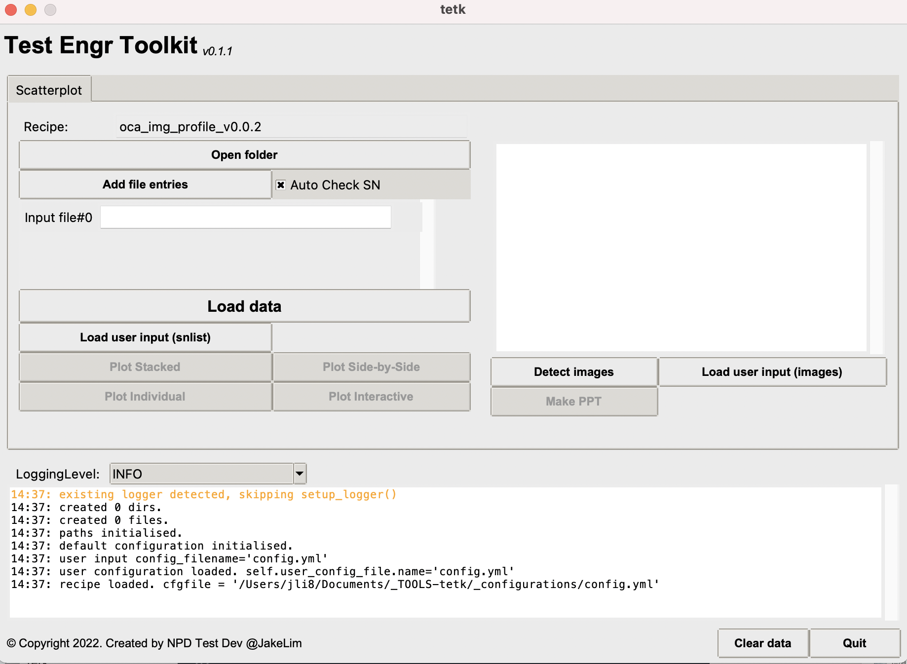
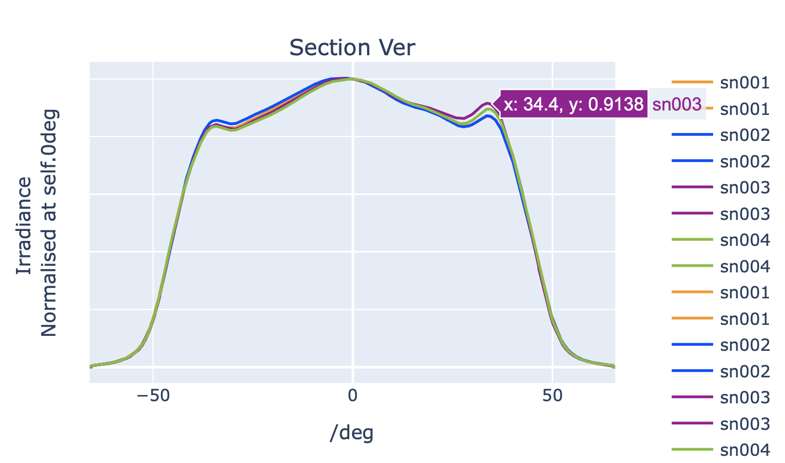
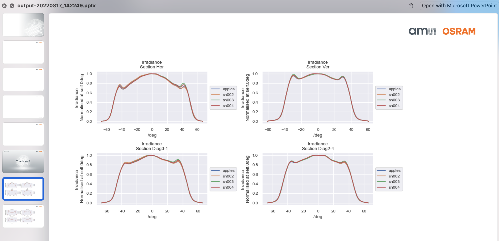

.. tetk documentation master file, created by
   sphinx-quickstart on Sat Aug 13 23:29:30 2022.
   You can adapt this file completely to your liking, but it should at least
   contain the root `toctree` directive.

Welcome to tetk's documentation!
================================

| **Tester Tool Kit**
| TETK is a data analysis tool with GUI developed to support test engineers.
| It aims to be simple to use, and yet powerful to support any project(s).
| No programming knowledge is required, engineers can configure project
| specific parameters using recipes.
|
| Custom-made function to support any data automation.
|
| Developed by Jake - NPD Test Dev
|
|
| Site is under construction.
| More content to be added later ...
|

Downloads
---------

#. **MacOS**

   #. :download:`tetk_v0.1.1 <_downloads/tetk_v0.1.1.dmg>`

   #. :download:`tetk_v0.0.5 <_downloads/tetk_v0.0.5.dmg>`

#. **Win**

   #. Unavailable

#. **Sample files**

   #. :download:`OCA-samplefiles-22h17 <_downloads/OCA-samplefiles-22h17.7z>`

Screenshots
-----------

Contents
--------

.. toctree::
   :maxdepth: 2
   :caption: Contents:

   releasenotes
   getstarted
   config
   reader
   plotmaker
   makeppt

Indices and tables
==================

* :ref:`genindex`
* :ref:`modindex`
* :ref:`search`
